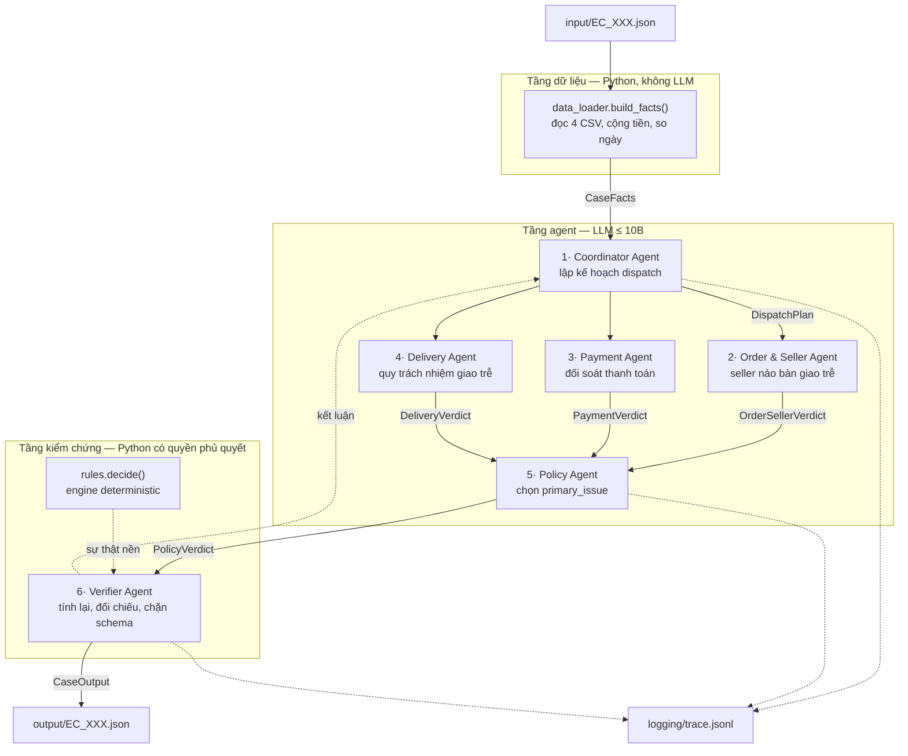
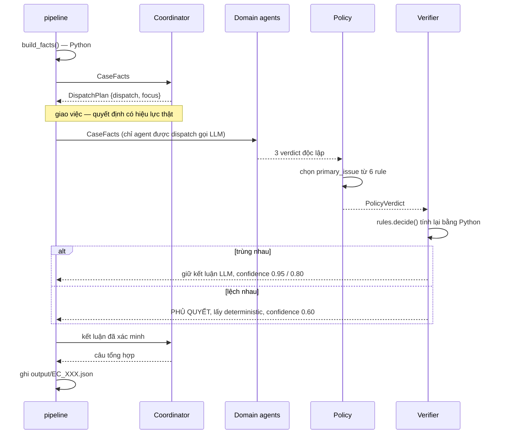

# Kiến trúc hệ thống Multi-Agent — EC_POLICY_V1

Hệ thống điều tra 50 khiếu nại thương mại điện tử trên dữ liệu Olist bằng 6 agent
có phân công, handoff bằng chứng và kiểm chứng chéo.

---

## 1. Nguyên tắc thiết kế

Ràng buộc của lab là **mỗi agent chỉ được dùng model ≤ 10B tham số** (README §9.1).
Model ở tầm 7–8B làm tốt việc phán đoán và diễn giải, nhưng làm tệ đúng ba thứ mà
bài này chấm nặng nhất: cộng tiền nhiều dòng, so sánh timestamp, và giữ đúng thứ tự
ưu tiên của 6 rule.

Vì vậy hệ thống tách bạch hai loại việc:

| Loại việc | Ai làm | Lý do |
| --- | --- | --- |
| Trích xuất, cộng tiền, so ngày | **Python** (`data_loader.py`) | Phải chính xác tuyệt đối, sai một cent là mất 20% điểm financial |
| Phán đoán, quy trách nhiệm, giao việc, diễn giải | **LLM** (6 agent) | Đây là phần suy luận thật, có handoff và ghi vào trace |
| Kiểm chứng và phủ quyết | **Python** (`verifier.py`) | Chốt chặn cuối chống hard gate |

Điều này **không** biến agent thành hình thức: Coordinator thật sự quyết định
dispatch ai, Policy thật sự chọn `primary_issue` từ 6 rule, và cả hai quyết định đó
đều có hiệu lực. Python chỉ đảm bảo phần **số học** không bao giờ sai.

---

## 2. Sơ đồ agent



---

## 3. Vai trò từng agent

| # | Agent | File | Quyết định gì | Fallback khi LLM hỏng |
| --- | --- | --- | --- | --- |
| 1 | **Coordinator** | `src/agents/coordinator.py` | Dispatch agent nào; viết kết luận tổng hợp | Dispatch cả 3 domain agent |
| 2 | **Order & Seller** | `src/agents/order_seller.py` | Seller nào bàn giao sau `shipping_limit_date` | `late_seller_ids` từ Python |
| 3 | **Payment** | `src/agents/payment.py` | Có phải split payment hợp lệ | `payment_matches` từ Python |
| 4 | **Delivery** | `src/agents/delivery.py` | Quy trách nhiệm: seller / logistics / none | So sánh ngày từ Python |
| 5 | **Policy** | `src/agents/policy.py` | **`primary_issue`** theo 6 rule ưu tiên | `rules.decide()` |
| 6 | **Verifier** | `src/agents/verifier.py` | Chấp nhận hay phủ quyết kết luận của Policy | Không dùng LLM — luôn deterministic |

`src/pipeline.py` không phải agent. Nó chỉ **thi hành** kế hoạch Coordinator giao.

---

## 4. Quyền truy cập dữ liệu

Đây là ranh giới quan trọng nhất của hệ thống: **không agent nào được đọc CSV trực tiếp.**

| Thành phần | Được đọc | Không được đọc |
| --- | --- | --- |
| `data_loader.py` | 4 file CSV: `orders`, `order_items`, `order_payments`, `sellers` | — |
| Coordinator | `facts_brief(f)` — bản rút gọn của `CaseFacts` | CSV, verdict của agent khác |
| Order & Seller | `facts_brief(f)` | CSV, verdict của agent khác |
| Payment | `facts_brief(f)` | CSV, verdict của agent khác |
| Delivery | `facts_brief(f)` | CSV, verdict của agent khác |
| Policy | `facts_brief(f)` **+ verdict của 3 agent trên** | CSV |
| Verifier | `CaseFacts` đầy đủ + `PolicyVerdict` + `rules.decide()` | — (là chốt chặn cuối) |

Năm CSV còn lại (`products`, `customers`, `geolocation`, `order_reviews`,
`product_category_name_translation`) **không được nạp**. Không rule nào trong
EC_POLICY_V1 cần đến chúng, và nạp `geolocation` (61 MB) chỉ làm chậm khởi động.

Ba hệ quả của ranh giới này:

1. Model không thể bịa dữ liệu từ dòng CSV mà nó "nhớ mang máng".
2. Mọi con số trong output truy được về đúng một hàm Python.
3. Ba domain agent chạy độc lập, không thấy kết luận của nhau — nên bằng chứng
   chúng đưa lên Policy là độc lập thật, không phải hùa theo agent chạy trước.

---

## 5. Luồng handoff



Mỗi bước ghi một dòng vào `logging/trace.jsonl`. Một case sinh đúng **10 event**:

```
case_start → facts_extracted → dispatch_plan → handoff ×4 → verified → summary → case_done
```

---

## 6. Cơ chế chống hard gate

Case bị hard gate nhận 0 điểm, nên hệ thống có bốn lớp bảo vệ xếp chồng:

| Lớp | Cơ chế | Chặn được gì |
| --- | --- | --- |
| 1 | JSON mode + `tenacity` retry | Model trả JSON hỏng, provider rate-limit |
| 2 | `call_json()` trả `None`, không raise | Một agent chết kéo đổ cả run |
| 3 | Fallback deterministic ở mọi agent | Không có LLM vẫn ra output hợp lệ |
| 4 | Pydantic validator trong `schemas.py` | Vượt giới hạn 5 ID / 10 evidence / 3 cause / 5 action, sai enum, `confidence` ngoài `[0,1]` |

Thêm hai chốt riêng:

- **Chặn evidence bịa.** `verifier._checks()` dựng tập ID hợp lệ từ CSV rồi đối chiếu
  từng evidence ID. Trong `order_seller.py`, seller ID model đề xuất bị lọc qua
  `f.seller_ids` — model nêu seller không có trong đơn thì bị bỏ.
- **Phủ quyết số học.** Refund luôn suy ra từ `primary_issue` bằng Python, model
  không bao giờ được tự điền số tiền.

---

## 7. Confidence

`confidence` không phải số bịa. Nó phản ánh mức đồng thuận thật giữa hai đường suy luận:

| Tình huống | Giá trị |
| --- | --- |
| LLM và deterministic trùng nhau, mọi agent gọi LLM thành công | `0.95` |
| Trùng nhau nhưng có agent phải fallback | `0.80` |
| Lệch nhau → lấy deterministic | `0.60` |

Agent bị Coordinator cố ý bỏ qua **không** bị tính là fallback — đó là quyết định
điều phối hợp lệ, không phải lỗi.

---

## 8. Engine EC_POLICY_V1

`src/rules.py` áp 6 rule **theo đúng thứ tự ưu tiên** README §4. Rule khớp đầu tiên
là kết quả cuối, không xét tiếp:

| # | `primary_issue` | Điều kiện | Refund |
| --- | --- | --- | --- |
| 1 | `canceled_order_paid` | `status = canceled` và payment > 0 | tổng payment |
| 2 | `unavailable_order_paid` | `status = unavailable` và payment > 0 | tổng payment |
| 3 | `late_delivery_seller` | giao trễ **và** carrier nhận sau `shipping_limit_date` | tổng freight |
| 4 | `late_delivery_logistics` | giao trễ **và** carrier nhận đúng hạn | tổng freight |
| 5 | `valid_split_payment` | ≥ 2 payment row **và** khớp trong 0.10 BRL | 0 |
| 6 | `unsupported_late_claim` | giao đúng hạn **và** payment khớp | 0 |

Thứ tự này là phần dễ sai nhất, nên `tests/test_rules.py` có 5 test chuyên kiểm tra
va chạm ưu tiên: đơn bị hủy **và** giao trễ phải ra rule 1 chứ không phải rule 3;
giao trễ **và** có split payment phải ra rule 3/4 chứ không phải rule 5.

Một chi tiết dễ bỏ sót: `delivered_late = None` (đơn chưa giao) **không** đồng nghĩa
"giao đúng hạn", nên không được rơi vào rule 6. Có test riêng cho ca này.

---

## 9. Model và cấu hình

Tên model khai báo trong `src/config.py` (README §9.4 cấm để trong `.env`), và được
ghi lại vào `logging/metadata.json` mỗi lượt chạy.

```python
MODEL_NAME           = "..."     # ≤ 10B tham số
MODEL_PARAMETER_SIZE = "..."
```

`.env` chỉ chứa `LLM_BASE_URL` và `LLM_API_KEY`. Nhờ dùng SDK `openai`, đổi provider
(Groq / Together / OpenRouter / Ollama / vLLM) chỉ cần sửa `.env`, không đụng code.

Lưu ý về ràng buộc ≤ 10B: đếm **tổng tham số**, không phải active params — model MoE
20B là vi phạm dù chỉ kích hoạt ~3B.

---

## 10. Chạy

```bash
pytest -q                    # 20 test cho engine deterministic
python -m src.llm_client     # kiểm tra endpoint sống
python run.py --no-llm       # 50 case deterministic, ~1s — lưới an toàn
python run.py --case EC_001  # 1 case, để debug
python run.py                # chạy thật đầy đủ
```

Sinh ra: `output/EC_001.json` … `EC_050.json`, `logging/trace.jsonl` (ghi đè mỗi
lượt, chỉ giữ lượt mới nhất theo README §8) và `logging/metadata.json`.
